# Operating System Design and Implementation

## Memory Management

* Using the buddy system to manage page memory allocation.

ref: https://github.com/lotabout/buddy-system

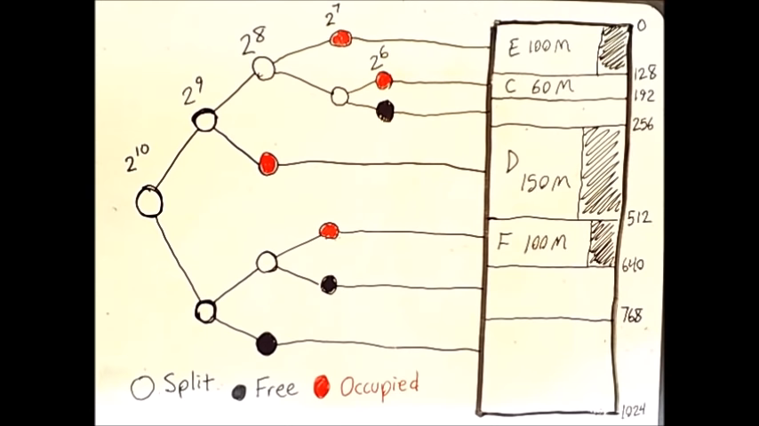

```c
void page_test()
{   
    printf("\n***** Page alloc test *****\n");
    void *p = page_alloc(1 * KB);
    printf("Allocate 1KB : 0x%x\n", p);

    void *p2 = page_alloc(2 * KB);
    printf("Allocate 2KB : 0x%x\n", p2);

    void *p3 = page_alloc(4 * KB);
    printf("Allocate 4KB : 0x%x\n", p3);

    page_free(p2);
    void *p4 = page_alloc(1 * KB);
    printf("Allocate 1KB : 0x%x\n", p4);

    void *p5 = page_alloc(2 * KB);
    printf("Allocate 2KB : 0x%x\n", p5);

    buddy_dump(buddy_sys);
}
```

### result

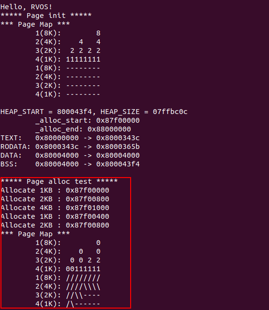

***

## Context Switch

* Implementation of switch
```asm
.macro reg_save base
	sw ra, 0(\base)
	sw sp, 4(\base)
	sw gp, 8(\base)
	sw tp, 12(\base)
	sw t0, 16(\base)
	sw t1, 20(\base)
    ...
	sw t5, 116(\base)
	# we don't save t6 here, due to we have used
	# it as base, we have to save t6 in an extra step
	# outside of reg_save
.endm

# restore all General-Purpose(GP) registers from the context
# struct context *base = &ctx_task;
# ra = base->ra;
# ......
.macro reg_restore base
	lw ra, 0(\base)
	lw sp, 4(\base)
	lw gp, 8(\base)
	lw tp, 12(\base)
	lw t0, 16(\base)
	lw t1, 20(\base)
    ...
	lw t5, 116(\base)
	lw t6, 120(\base)
.endm

# void switch_to(struct context *next);
# a0: pointer to the context of the next task
.globl switch_to
.align 4
switch_to:
    csrrw t6, mscratch, t6      # swap t6 and mscratch
    beqz t6, 1f

    reg_save t6                 # save context of prev task

	# Save the actual t6 register, which we swapped into
	# mscratch
    mv t5, t6
    csrr t6, mscratch
    sw t6, 120(t5)
1:
    # switch mscratch to point to the context of the next task
    csrw mscratch, a0

    # Restore all GP registers
    # Use t6 to point to the context of the task0
    mv t6, a0
    reg_restore t6

    ret
```

* Created two processes
```c
void user_task0(void)
{
    uart_puts("Task 0: Created!\n");
    char s[] = "12345";
    while (1) {
        for (int i = 0; i < 5; i++) {
            uart_putc(s[i]);
            task_delay(DELAY);
            task_yield();
        }
    }
}

void user_task1(void)
{
    uart_puts("Task 1: Created!\n");
    char s[] = "abcde";
    while (1) {
        for (int i = 0; i < 5; i++) {
            uart_putc(s[i]);
            task_delay(DELAY);
            task_yield();
        }
    }
}
```


### result

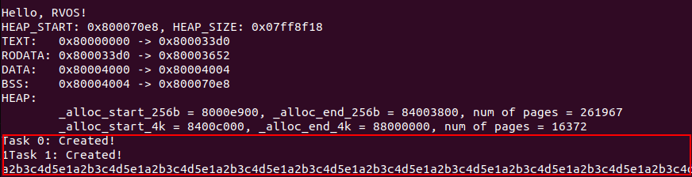

***

## Exception & Interrupt handling

* Three types of interrupt
    * Software interrupt
    * Timer interrupt
    * Externel interrupt

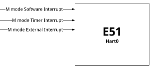

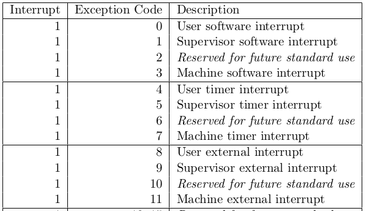

* Machine Interrupt Enable Register (mie)

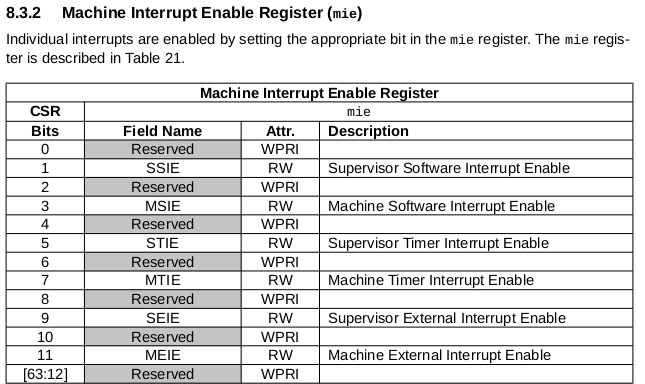

* Platform-Level Interrupt Controller (PLIC)

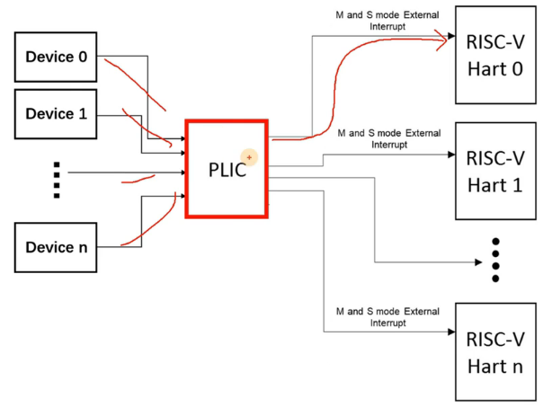
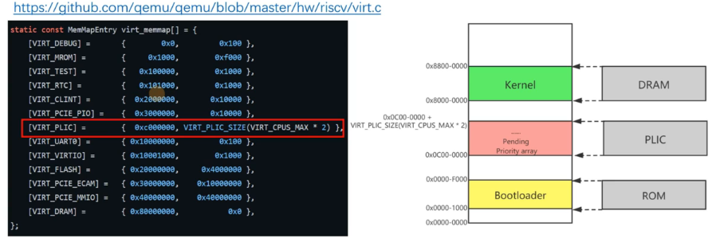

```c
/* 
 * Set priority for UART0.
 *
 * Each PLIC interrupt source can be assigned a priority by writing 
 * to its 32-bit memory-mapped priority register.
 */
*(uint32_t *) PLIC_PRIORITY(UART0_IRQ) = 1;
```
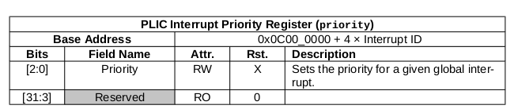

```c
#define PLIC_MCLAIM(hart) (PLIC_BASE + 0x200004 + (hart) * 0x1000)
#define PLIC_MCOMPLETE(hart) (PLIC_BASE + 0x200004 + (hart) * 0x1000)

/* 
 * DESCRIPTION:
 *	Query the PLIC what interrupt we should serve.
 */
int plic_claim(void)
{
    int hart = r_tp();
    int irq = *(uint32_t *) PLIC_MCLAIM(hart);
    return irq;
}

/* 
 * DESCRIPTION:
  *	Writing the interrupt ID it received from the claim (irq) to the 
 *	complete register would signal the PLIC we've served this IRQ. 
 */
void plic_complete(int irq)
{
    int hart = r_tp();
    *(uint32_t *) PLIC_MCOMPLETE(hart) = irq;
}

void external_interrupt_handler()
{
    int irq = plic_claim();

    if (irq == UART0_IRQ) {
        uart_isr();
    } else if (irq) {
        printf("Unexpected interrupt irq = %d\n", irq);
    }

    if (irq) {
        plic_complete(irq);
    }
}

reg_t trap_handler(reg_t epc, reg_t cause)
{
    reg_t return_pc = epc;
    reg_t cause_code = cause & 0xfff;

    if (cause & 0x80000000) {
        switch (cause_code)
        {
        ...
        case 11:
            uart_puts("external interuption!\n");
            external_interrupt_handler();
            break;
        default:
            break;
        }
    } else {
        /* Synchronous trap - exception */
        printf("Sync exceptions!, code = %d\n", cause_code);
        panic("PANIC");
        // return_pc += 4;
    }
    
    return return_pc;
}
```
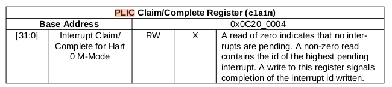

### result

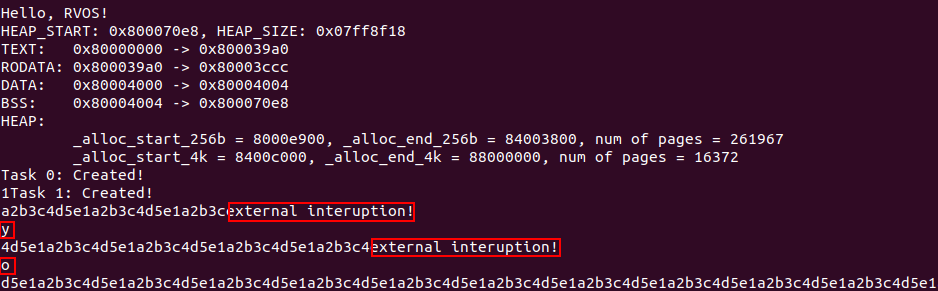

***

## Timer Interrupt

* Initialize timer & timer interval

```c

 /*
  * The Core Local INTerruptor (CLINT) block holds memory-mapped control and
  * status registers associated with software and timer interrupts.
  * QEMU-virt reuses sifive configuration for CLINT.
  * see https://gitee.com/qemu/qemu/blob/master/include/hw/riscv/sifive_clint.h
  * enum {
  * 	SIFIVE_SIP_BASE     = 0x0,
  * 	SIFIVE_TIMECMP_BASE = 0x4000,
  * 	SIFIVE_TIME_BASE    = 0xBFF8
  * };
  *
  * enum {
  * 	SIFIVE_CLINT_TIMEBASE_FREQ = 10000000
  * };
  *
  * Notice:
  * The machine-level MSIP bit of mip register are written by accesses to
  * memory-mapped control registers, which are used by remote harts to provide
  * machine-mode interprocessor interrupts.
  * For QEMU-virt machine, Each msip register is a 32-bit wide WARL register
  * where the upper 31 bits are tied to 0. The least significant bit is
  * reflected in the MSIP bit of the mip CSR. We can write msip to generate
  * machine-mode software interrupts. A pending machine-level software
  * interrupt can be cleared by writing 0 to the MSIP bit in mip.
  * On reset, each msip register is cleared to zero.
  */
#define CLINT_BASE 0x2000000L
#define CLINT_MSIP(hartid) (CLINT_BASE + 4 * (hartid))
#define CLINT_MTIMECMP(hartid) (CLINT_BASE + 0x4000 + 8 * (hartid))
#define CLINT_MTIME (CLINT_BASE + 0xBFF8) // cycles since boot.

/* 10000000 ticks per-second */
#define CLINT_TIMEBASE_FREQ 10000000
```

```c
/* load timer interval(in ticks) for next timer interrupt.*/
void timer_load(int interval)
{
	/* each CPU has a separate source of timer interrupts. */
	int id = r_mhartid();
	
	*(uint64_t*)CLINT_MTIMECMP(id) = *(uint64_t*)CLINT_MTIME + interval;
}

void timer_init()
{
	/*
	 * On reset, mtime is cleared to zero, but the mtimecmp registers 
	 * are not reset. So we have to init the mtimecmp manually.
	 */
	timer_load(TIMER_INTERVAL);

	/* enable machine-mode timer interrupts. */
	w_mie(r_mie() | MIE_MTIE);

	/* enable machine-mode global interrupts. */
	w_mstatus(r_mstatus() | MSTATUS_MIE);
}
```

* Timer interrupt handler

```c
void timer_handler()
{
    _tick++;
    printf("tick: %d\n", _tick);

    /* Update next interval */
    timer_load(TIMER_INTERVAL);
}

reg_t trap_handler(reg_t epc, reg_t cause)
{
	...
	if (cause & 0x80000000) {
		/* Asynchronous trap - interrupt */
		switch (cause_code) {
		...
		case 7:
			uart_puts("timer interruption!\n");
			timer_handler();
			break;
		...
			break;
		}
	} else {
		...
	}
    ...
}
```

### result

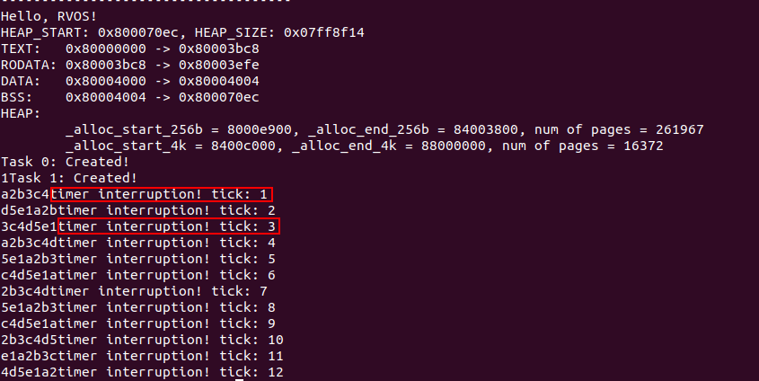

***

## Preemptive

* Preemptive Flowchart

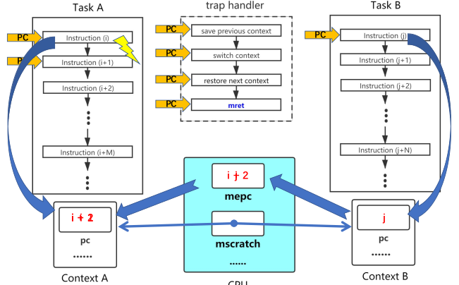

```assembly
trap_vector:
	# save all GP registers
	...
	# save mepc to context of current task
	csrr	a0, mepc
	sw	a0, 124(t5)
	...
	call	trap_handler
    ...
	mret
```

```assembly
# void switch_to(struct context *next);
switch_to:
	# switch current context
	csrw	mscratch, a0
	# set mepc to the pc of the next task
	lw	a1, 124(a0)
	csrw	mepc, a1
	# Restore all GP registers
	...
	mret
```

* Voluntarily yield CPU

```c
#define CLINT_BASE 0x2000000L
#define CLINT_MSIP(hartid) (CLINT_BASE + 4 * (hartid))


void task_yield()
{   
    /* trigger a machine-level software interrupt */
    int id = r_mhartid();
    *(uint32_t *) CLINT_MSIP(id) = 1;
}
```

```c
void timer_handler()
{
    /* Update next interval */
    timer_load(TIMER_INTERVAL);

    schedule();
}

reg_t trap_handler(reg_t epc, reg_t cause)
{
    reg_t return_pc = epc;
    reg_t cause_code = cause & 0xfff;

    if (cause & 0x80000000) {
        switch (cause_code)
        {
        case 3:
            uart_puts(" software interruption!\n");
            /*
			 * acknowledge the software interrupt by clearing
    		 * the MSIP bit in mip.
			 */
            int id = r_mhartid();
            *(uint32_t *) CLINT_MSIP(id) = 0;

            /* Voluntarily yield CPU */
            schedule();
            break;
        case 7:
            uart_puts(" timer interruption!\n");
            timer_handler();
            break;
        ...
        default:
            break;
        }
    } 
    ...
}
```

* Execute two processes

```c
void user_task0(void)
{
    uart_puts("Task 0: Created!\n");
    char s[] = "12345";

    task_yield();
    uart_puts("Task 0: I'm back!\n");
    while (1) {
        for (int i = 0; i < 5; i++) {
            uart_putc(s[i]);
            task_delay(DELAY);
        }
    }
}

void user_task1(void)
{
    uart_puts("Task 1: Created!\n");
    char s[] = "abcde";
    while (1) {
        for (int i = 0; i < 5; i++) {
            uart_putc(s[i]);
            task_delay(DELAY);
        }
    }
}
```

### result

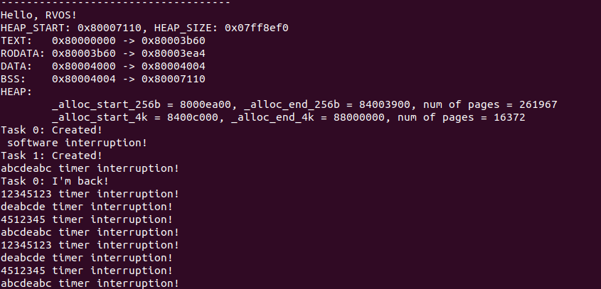

***

## System Call

### Switching to system mode

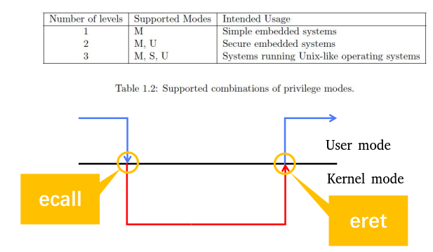

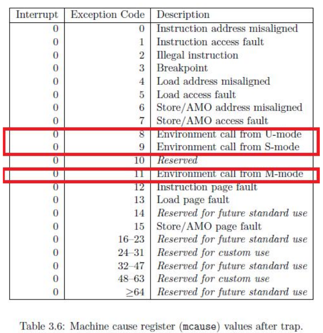

### The execution process of a system call

* Do `return_pc += 4` to set the `program counter` to `ret` that after the `ecall`

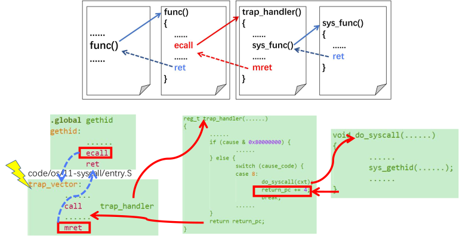

* `trap_handler`

```c
reg_t trap_handler(reg_t epc, reg_t cause, struct context *cxt)
{
    reg_t return_pc = epc;
    reg_t cause_code = cause & 0xfff;

    if (cause & 0x80000000) {
        /* Asynchronous trap - interrupt */
        switch (cause_code)
        {
        ...
        default:
            break;
        }
    } else {
        /* Synchronous trap - exception */
        printf("Sync exceptions!, code = %d\n", cause_code);
        switch (cause_code) {
        case 8:
            uart_puts("System call from U-mode!\n");
			do_syscall(cxt);
			return_pc += 4;
            break;
        default:
            panic("PANIC");
            // return_pc += 4;
            break;
        }
    }
    return return_pc;
}
```

### result

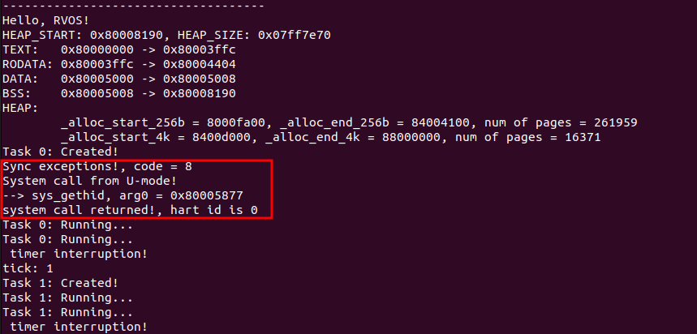